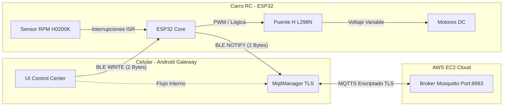
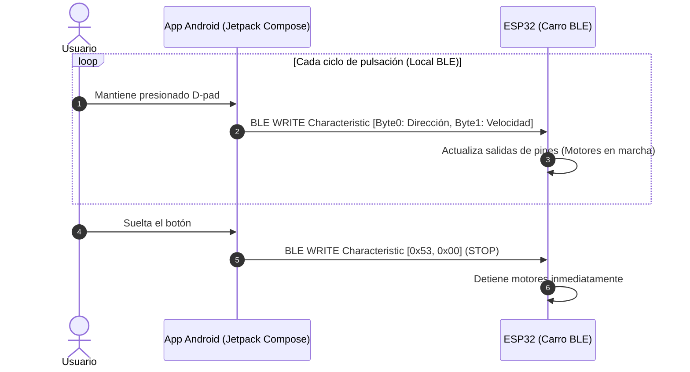
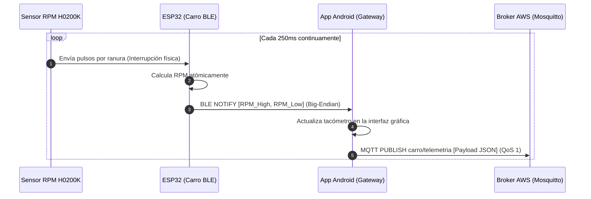
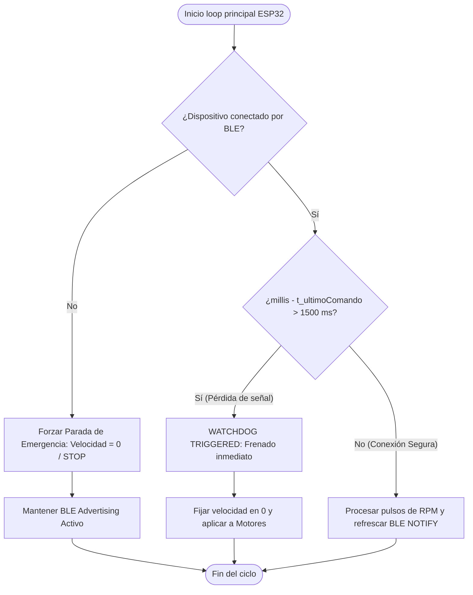
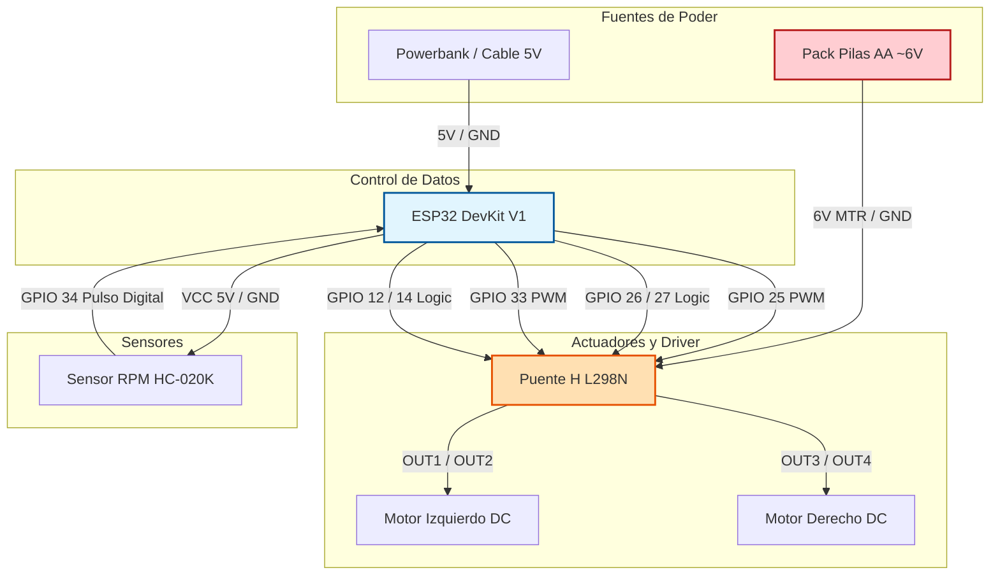

# 🚗 Carro RC IoT — ESP32 (BLE) + Android Gateway + MQTT

**Curso:** Internet de las Cosas — Universidad de La Sabana, 2026.

**Descripción:** Vehículo a escala controlado localmente mediante **Bluetooth Low Energy (BLE)** desde una app Android (Jetpack Compose). La aplicación móvil funciona como un *Edge Gateway IoT*, asumiendo la responsabilidad de conectarse a la nube para enviar la telemetría de velocidad (RPM) en tiempo real a un broker MQTT seguro desplegado en AWS EC2.

**Viabilidad Económica y Tecnológica:** El costo total del hardware del prototipo asciende a $121.000 COP, posicionándose como una solución educativa de bajo costo un 70% más económica que las plataformas comerciales de desarrollo IoT de arquitectura cerrada. Al delegar la conectividad en la nube a la aplicación móvil, se reduce drásticamente el consumo energético del ESP32 y se elimina la necesidad de gestionar credenciales Wi-Fi dinámicas en el firmware del vehículo.

---

## Tabla de Contenidos

1. [Visión General](#1-visión-general)
2. [Arquitectura del Sistema](#2-arquitectura-del-sistema)
3. [Diagramas de Secuencia y Flujo](#3-diagramas-de-secuencia-y-flujo)
4. [Protocolo de Comunicación Local (BLE)](#4-protocolo-de-comunicación-local-ble)
5. [Tópicos MQTT (Gateway ↔ Cloud)](#5-tópicos-mqtt-gateway--cloud)
6. [Hardware y Esquemático](#6-hardware-y-esquemático)
7. [Librerías Utilizadas](#7-librerías-utilizadas)
8. [Uso de Memoria](#8-uso-de-memoria)
9. [Mecanismos de Robustez y Seguridad](#9-mecanismos-de-robustez-y-seguridad)
10. [Limitaciones](#10-limitaciones)
11. [Posibilidades de Mejora](#11-posibilidades-de-mejora)
12. [Referencias Bibliográficas](#12-referencias-bibliográficas)

---

## 1. Visión General

- **Problema:** El uso directo de Wi-Fi y protocolos pesados en la nube desde microcontroladores en movimiento genera inestabilidad por pérdidas de señal local, alto consumo energético y overhead de procesamiento por encriptación TLS.
- **Usuarios objetivo:** Estudiantes de Ingeniería y desarrolladores de robótica móvil.
- **Solución:** Arquitectura híbrida. Control local de ultra baja latencia mediante **BLE (GATT Server)** entre el coche y el celular. Monitoreo remoto global delegando el stack de red **MQTT (MQTTS con TLS 1.3)** a la aplicación de Android, la cual actúa como pasarela inteligente.

---

## 2. Arquitectura del Sistema

El ESP32 opera de forma local e independiente de internet. La app móvil es el puente de datos (*Edge Gateway*):



**Descripción del flujo:**

- El **Usuario** interactúa con la interfaz en Jetpack Compose. Al presionar el D-pad, la app envía comandos directamente al ESP32 mediante escrituras BLE directas (**BLE WRITE**) con una latencia despreciable.
- El **ESP32** recibe el comando binario, altera el ciclo de trabajo (PWM) del puente H L298N y varía la velocidad de los motores DC de manera inmediata.
- El **Sensor HC-020K** interrumpe el flujo del microcontrolador con cada ranura del disco detectada. El ESP32 calcula de manera atómica las RPM actuales.
- Cada 250 ms, el ESP32 envía las RPM hacia la aplicación móvil usando notificaciones asíncronas (**BLE NOTIFY**).
- La **App Android (Gateway)** recibe el dato de RPM local, actualiza la interfaz gráfica del usuario (tacómetro) y de forma paralela empaqueta la telemetría en formato JSON para **publicarla en el Broker MQTT (Mosquitto)** protegido con TLS 1.3 en AWS EC2.

---

## 3. Diagramas de Secuencia y Flujo

### 3.1 Secuencia de control (App → ESP32)



### 3.2 Secuencia de telemetría (ESP32 → App → Cloud)



### 3.3 Watchdog de seguridad



---

## 4. Protocolo de Comunicación Local (BLE)

El ESP32 expone un servicio GATT personalizado con dos características principales:

### Característica de Control (UUID: `19B10001-E8F2-537E-4F6C-D104768A1214`) — [WRITE]
Recibe arreglos binarios de 2 bytes enviados por la app móvil:
```
Byte 0 — Dirección:
  0x46 ('F') = Adelante (Forward)
  0x42 ('B') = Atrás (Backward)
  0x4C ('L') = Izquierda (Left)
  0x52 ('R') = Derecha (Right)
  0x53 ('S') = Stop (Detener)

Byte 1 — Velocidad PWM: 0x00–0xFF (0–255)

Ejemplo: [0x46, 0x80] = Comando avanzar al 50% de potencia (128/255).
```

### Característica de Telemetría (UUID: `19B10002-E8F2-537E-4F6C-D104768A1214`) — [NOTIFY]
Transmite el cálculo de velocidad de rotación en formato Big-Endian de 2 bytes:
```
Byte 0: RPM_HIGH (Byte más significativo)
Byte 1: RPM_LOW  (Byte menos significativo)

Reconstrucción en App: RPM = (Byte0 << 8) | Byte1
Ejemplo: [0x01, 0xF4] = 500 RPM.
```

---

## 5. Tópicos MQTT (Gateway ↔ Cloud)

Dado que el celular opera como una pasarela inteligente (*Edge Gateway*), este intercepta los bytes crudos del BLE, estructura los datos en formato JSON y los publica de forma segura en la nube:

| Tópico | Quién publica | Quién suscribe | QoS | Payload | Descripción |
|---|---|---|---|---|---|
| `carro/telemetria` | App Android | Dashboards / Clientes | 1 | JSON texto | Envío periódico de RPM y estado del enlace local |
| `carro/eventos` | App Android | Dashboards / Clientes | 1 | JSON texto | Alertas críticas (Ej: Desconexión BLE, disparos del Watchdog) |

### Formato del payload enviado a `carro/telemetria`
```json
{
  "device_id": "esp32_carro_rc_01",
  "rpm": 420,
  "gateway_rssi_ble": -54,
  "timestamp": "2026-05-25T13:02:11Z"
}
```

---

## 6. Hardware y Esquemático

### Lista de Componentes

| Componente | Cantidad | Costo (COP) | Función |
|---|---|---|---|
| ESP32 DevKit V1 | 1 | $35.000 | Microcontrolador principal, servidor BLE y control lógico |
| Puente H L298N | 1 | $18.000 | Driver de potencia para motores DC (hasta 2A por canal) |
| Kit Chasis Móvil | 1 | $40.000 | Estructura mecánica, motores reductores y ruedas |
| Sensor HC-020K | 1 | $8.000 | Disco ranurado + encoder óptico para lectura de velocidad |
| Pilas AA x4 + Portapilas | 1 | $20.000 | Fuente de alimentación independiente para motores (~6V) |
| **Total** | | **$121.000** | **Solución costo-eficiente** |

### Pinout de Conexión

| Señal de Control | Pin ESP32 | Descripción |
|---|---|---|
| **ENA** (Motor A) | GPIO 25 | Salida PWM - Control velocidad motor izquierdo |
| **IN1** | GPIO 26 | Salida Digital - Sentido motor izquierdo |
| **IN2** | GPIO 27 | Salida Digital - Sentido motor izquierdo |
| **ENB** (Motor B) | GPIO 33 | Salida PWM - Control velocidad motor derecho |
| **IN3** | GPIO 12 | Salida Digital - Sentido motor derecho |
| **IN4** | GPIO 14 | Salida Digital - Sentido motor derecho |
| **Sensor OUT** | GPIO 34 | Entrada Digital - Captura de pulsos (Interrupción ISR) |



---

## 7. Librerías Utilizadas

### ESP32 (Arduino IDE)
* **`BLEDevice.h` / `BLEUtils.h` / `BLEServer.h` / `BLE2902.h`:** Stack embebido nativo del core de ESP32 para gestionar el Servidor GATT, perfiles de servicios y los descriptores para las notificaciones asíncronas.

### Android (Kotlin / Jetpack Compose)
* **`HiveMQ MQTT Client` (v1.3.3):** Cliente reactivo de alta eficiencia compatible con Android para la comunicación cifrada TLS 1.3 con AWS EC2.
* **`Jetpack Compose BOM` (v2024.12.01) & `material3`:** Stack moderno para el renderizado de la interfaz gráfica del panel de instrumentos.
* **`accompanist-permissions` (v0.36.0):** Utilidades para solicitar de forma segura accesos de ubicación y escaneo BLE en tiempo de ejecución.

---

## 8. Uso de Memoria

> Valores obtenidos al presionar **Verificar (✔)** en Arduino IDE 2.x con la placa **ESP32 Dev Module**.


| Métrica | Valor Consumido | Máximo Disponible | % de Uso |
|---|---|---|---|
| Flash (Program Storage) | 720 KB | 1310 KB | 85% |
| RAM (Dynamic Memory) | 26.2 KB | 327 KB | 12% |


**Resultados del compilador en consola:**
```
Sketch uses 1125858 bytes (85%) of program storage space. Maximum is 1310720 bytes.
Global variables use 40688 bytes (12%) of dynamic memory, leaving 286992 bytes for local variables. Maximum is 327680 bytes.
```

---

## 9. Mecanismos de Robustez y Seguridad

1. **Watchdog de Enlace Local:** Si la app Android se congela o el usuario se aleja perdiendo el enlace inalámbrico, el ESP32 detecta la ausencia de escrituras por más de 1500 ms e inmediatamente detiene los motores.
2. **Aislamiento Eléctrico de Potencia:** El uso del puente H L298N actúa como barrera de potencia. Sus diodos de protección evitan que los picos de fuerza contraelectromotriz de los motores generen ruidos o reinicios inesperados (*brownouts*) en el ESP32.
3. **MQTTS con Cifrado TLS 1.3:** En el tramo crítico (Celular Gateway ➔ AWS Cloud), la información viaja completamente encriptada mediante TLS hacia el puerto seguro 8883 de Mosquitto, impidiendo ataques de interceptación de datos (*Man-in-the-Middle*).

---

## 10. Limitaciones

### Ruido en la lectura del sensor HC-020K
La limitación más relevante del prototipo es la **inestabilidad en las lecturas de RPM del sensor HC-020K**. Con una velocidad de motor constante (PWM fijo), el sensor reporta valores que varían aproximadamente **±300 RPM** entre mediciones consecutivas.
**Causas identificadas:**
- **Vibración mecánica:** El chasis de plástico propaga oscilaciones físicas que confunden al fototransistor generando falsos pulsos.
- **Rebote eléctrico (bouncing):** Los flancos de subida del sensor presentan ruido eléctrico de microsegundos que la interrupción ISR cuenta como giros extra.

### Otras Limitaciones
- **Un solo usuario concurrente:** Al ser una conexión de tipo BLE punto a punto, un único dispositivo celular puede comandar el vehículo simultáneamente.
- **Sin almacenamiento local (Store & Forward):** Si el celular pierde cobertura de datos móviles (4G/5G) en una zona aislada, la telemetría generada en ese lapso no se almacena en caché, produciendo vacíos informativos en el broker.

---

## 11. Posibilidades de Mejora

- **Filtro Digital de Media Móvil:** Implementar un búfer circular en el firmware del ESP32 para promediar las últimas 8 muestras de RPM antes de disparar la notificación BLE, mitigando drásticamente el ruido de lectura.
- **Filtro Anti-rebote por Hardware:** Añadir un capacitor de desacople de 100 nF en paralelo a los terminales de señal del sensor de RPM para limpiar los flancos de onda.
- **Estrategia Store-and-Forward en el Gateway:** Modificar la aplicación Android para que almacene en una base de datos local (Room/SQLite) las telemetrías cuando no haya cobertura celular, y las despache en ráfaga una vez recupere conexión con AWS.

---

## 12. Referencias Bibliográficas

[1] Espressif Systems, "ESP32 BLE API Architecture and GATT Server Overview," *Espressif Docs*, 2024. [En línea]. Disponible en: https://docs.espressif.com

[2] HiveMQ, "HiveMQ MQTT Client Library for Java/Kotlin tender implementations," HiveMQ GmbH, 2025. [En línea]. Disponible en: https://github.com/hivemq/hivemq-mqtt-client

[3] Eclipse Foundation, "Eclipse Mosquitto Security Configuration with TLS/SSL," *Mosquitto Documentation*, 2024. [En línea]. Disponible en: https://mosquitto.org/documentation/

---
*Documentación oficial desarrollada para la asignatura Internet de las Cosas, Universidad de La Sabana, 2026. Juan Felipe Moncada, Samuel Arcos y Juan Felipe Cardenas*
