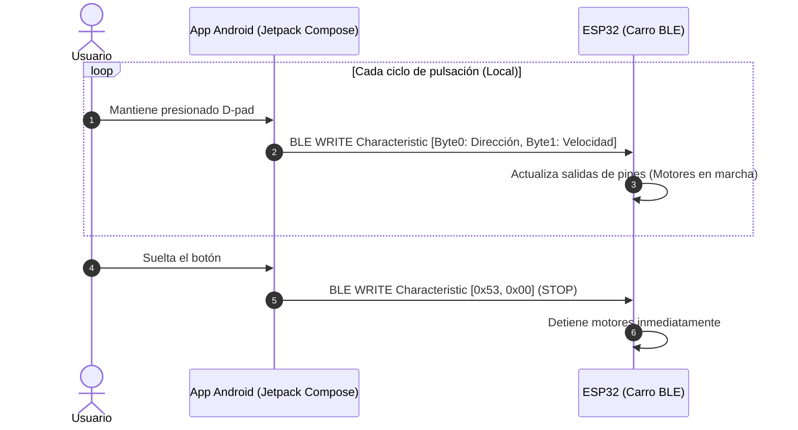
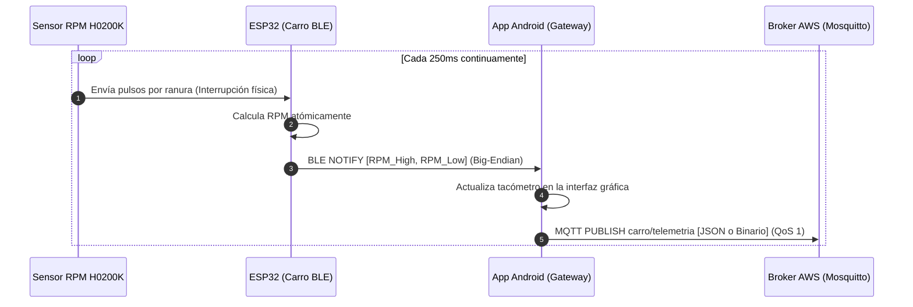
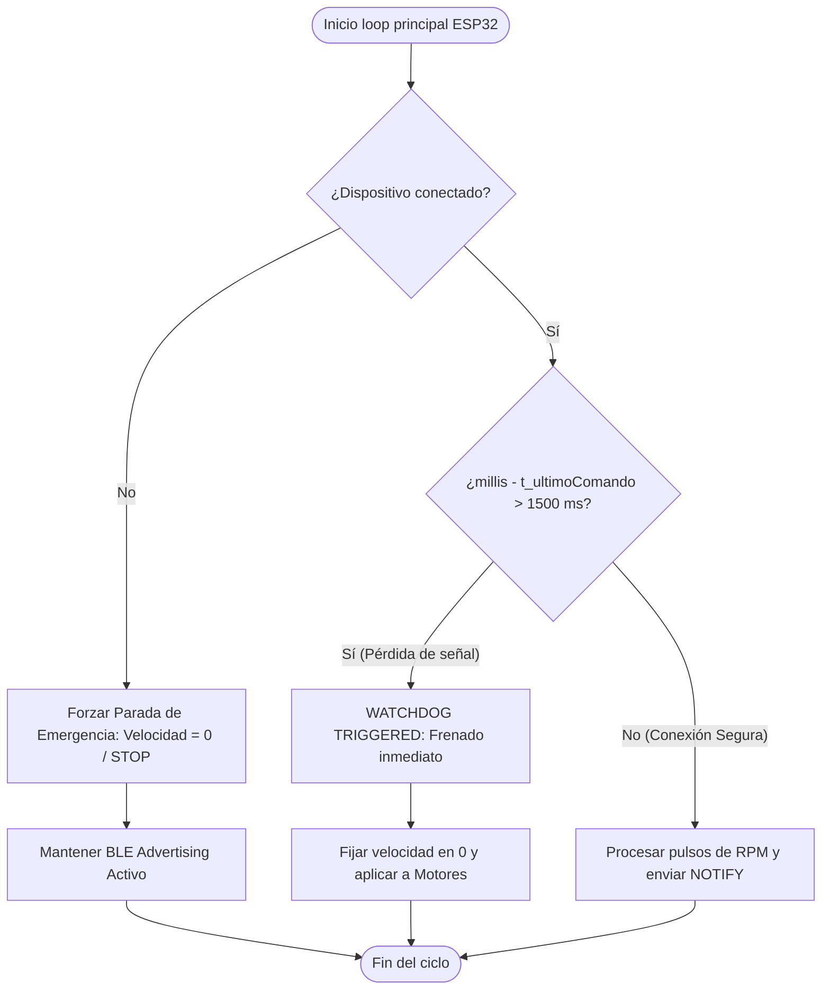
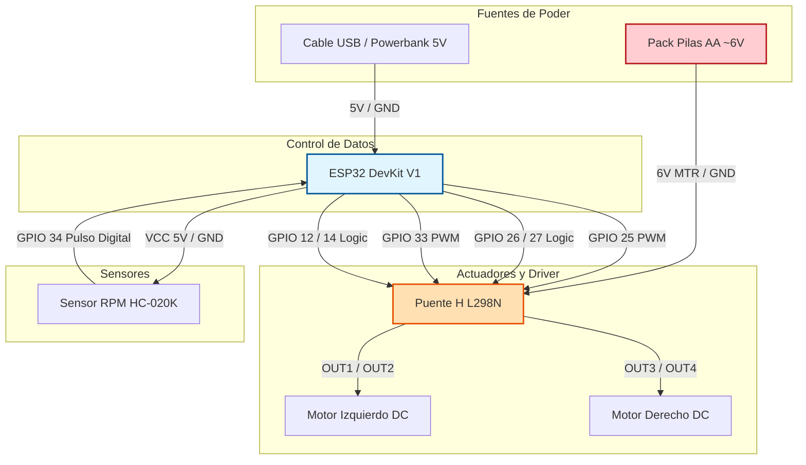

# 🚗 Carro RC IoT — ESP32 (BLE) + Android Gateway + MQTT

**Curso:** Internet de las Cosas — Universidad de La Sabana, 2026.

**Descripción:** Vehículo a escala controlado localmente mediante **Bluetooth Low Energy (BLE)** desde una app Android (Jetpack Compose). La aplicación móvil funciona como un *Gateway IoT*, asumiendo la responsabilidad de conectarse a la nube para enviar la telemetría de velocidad (RPM) en tiempo real a un broker MQTT seguro desplegado en AWS EC2.

**Viabilidad Económica y Tecnológica:** El costo total del hardware del prototipo asciende a $121.000 COP, posicionándose como una solución educativa de bajo costo un 70% más económica que las plataformas comerciales de desarrollo IoT de arquitectura cerrada. Al delegar la conectividad en la nube a la aplicación móvil, se reduce drásticamente el consumo energético del ESP32 y se elimina la necesidad de gestionar credenciales Wi-Fi dinámicas en el firmware del vehículo.

---

## Tabla de Contenidos

1. [Visión General](#1-visión-general)
2. [Arquitectura del Sistema](#2-arquitectura-del-sistema)
3. [Diagramas de Secuencia y Flujo](#3-diagramas-de-secuencia-y-flujo)
4. [Protocolo de Comunicación Local (BLE)](#4-protocolo-de-communication-local-ble)
5. [Tópicos MQTT (App ↔ Cloud)](#5-tópicos-mqtt-app--cloud)
6. [Hardware y Esquemático](#6-hardware-y-esquemático)
7. [Librerías Utilizadas](#7-librerías-utilizadas)
8. [Mecanismos de Robustez y Seguridad](#8-mecanismos-de-robustez-y-seguridad)

---

## 1. Visión General

- **Problema:** El uso directo de Wi-Fi y protocolos pesados en la nube desde microcontroladores en movimiento genera inestabilidad por pérdidas de señal local, alto consumo energético y overhead de procesamiento por encriptación TLS.
- **Usuarios objetivo:** Estudiantes de Ingeniería y desarrolladores de robótica móvil.
- **Solución:** Arquitectura híbrida. Control local de ultra baja latencia mediante **BLE (GATT Server)** entre el coche y el celular. Monitoreo remoto global delegando el stack de red **MQTT (MQTTS con TLS 1.3)** a la aplicación de Android.

---

## 2. Arquitectura del Sistema

El ESP32 opera de forma local e independiente de internet. La app móvil es el puente de datos (*Edge Gateway*):

```mermaid
graph LR
    subgraph Prototipo_Embebido [Carro RC - ESP32]
        H[Sensor RPM H0200K] -->|Interrupciones ISR| E[ESP32 Core]
        E -->|PWM / Lógica| F[Puente H L298N]
        F -->|Voltaje Variable| G[Motores DC]
    end

    subgraph Cliente_Android [Celular - Android Gateway]
        A[UI Control Center] -->|BLE WRITE (2 Bytes)| E
        E -->|BLE NOTIFY (2 Bytes)| B(MqttManager TLS)
        A -.->|Flujo Interno| B
    end

    subgraph Nube_AWS [AWS EC2 Cloud]
        C[Broker Mosquitto Port:8883]
    end

    B <-->|MQTTS Encriptado TLS| C
```

**Descripción del flujo:**

- La **app Android** publica comandos de 2 bytes en `carro/control` cada 500 ms mientras el usuario mantiene presionado un botón del D-pad.
- El **broker Mosquitto** (AWS EC2, puerto 8883 TLS) enruta los mensajes entre la app y el ESP32 sin que ninguno de los dos se comunique directamente entre sí.
- El **ESP32** recibe los comandos, los aplica al puente H L298N para mover los motores, y publica las RPM medidas en `carro/telemetria` cada 250 ms.
- El **sensor HC-020K** genera pulsos digitales por interrupción que el ESP32 convierte a RPM.
- El ESP32 también expone un endpoint HTTP `GET /status` accesible por IP local, independiente del broker.

---

## 3. Diagrama de Flujo / Secuencia

### 3.1 Secuencia de control (App → ESP32)

<!-- ============================================================
     DIAGRAMA 2 — DIAGRAMA DE SECUENCIA: CONTROL
     Tipo sugerido: sequenceDiagram
     Participantes: App Android, Broker MQTT, ESP32
     Mostrar:
       - Conexión TLS de ambos lados al broker
       - App publica en carro/control cada 500ms
       - Broker reenvía al ESP32
       - ESP32 aplica motores
       - Al soltar botón: App publica STOP [0x53, 0x00]
     Este diagrama cumple el requisito de "diagrama UML" (secuencia).
     ============================================================ -->



### 3.2 Secuencia de telemetría (ESP32 → App)

<!-- ============================================================
     DIAGRAMA 3 — DIAGRAMA DE SECUENCIA: TELEMETRÍA
     Tipo sugerido: sequenceDiagram
     Participantes: ESP32, Broker MQTT, App Android
     Mostrar:
       - ESP32 publica [RPM_HIGH, RPM_LOW] cada 250ms
       - Broker reenvía a App
       - App actualiza tacómetro en pantalla
     Puede ir en el mismo diagrama que el anterior si prefieren.
     ============================================================ -->



### 3.3 Watchdog de seguridad

<!-- ============================================================
     DIAGRAMA 4 — DIAGRAMA DE ESTADOS O FLOWCHART: WATCHDOG
     Tipo sugerido: flowchart TD
     Mostrar:
       - loop() evalúa si (ahora - ultimoComando) > 1500ms
       - Si sí → velocidad=0, STOP, aplicarMotores()
       - Si no → continuar normal
     Es corto pero importante: demuestra que el diseño
     considera fallos de red (requisito de robustez).
     ============================================================ -->



---

## 4. Tópicos MQTT

| Tópico | Quién publica | Quién suscribe | QoS | Payload |
|---|---|---|---|---|
| `carro/control` | App Android | ESP32 | 0 | 2 bytes binarios |
| `carro/telemetria` | ESP32 | App Android | 1 | 2 bytes binarios |
| `carro/status` | ESP32 | App Android | 0 | JSON texto |

### Formato del payload `carro/control`

```
Byte 0 — Dirección:
  0x46 ('F') = Adelante
  0x42 ('B') = Atrás
  0x4C ('L') = Izquierda
  0x52 ('R') = Derecha
  0x53 ('S') = Stop

Byte 1 — Velocidad PWM: 0x00–0xFF (0–255)

Ejemplo: [0x46, 0x80] = Adelante a velocidad 128/255
```

### Formato del payload `carro/telemetria`

```
Byte 0: RPM_HIGH (byte más significativo)
Byte 1: RPM_LOW  (byte menos significativo)

RPM = (Byte0 << 8) | Byte1

Ejemplo: [0x01, 0xF4] = 500 RPM
```

### Formato del payload `carro/status`

```json
{
  "status": "ok",
  "uptime_s": 142,
  "rpm": 320,
  "wifi_rssi": -68
}
```

---

## 5. Endpoints API

### `GET /status` — Healthcheck del ESP32

Verifica que el ESP32 está encendido, conectado a WiFi y al broker MQTT. Funciona de forma **independiente al broker**: si MQTT cae pero el ESP32 sigue con WiFi, este endpoint sigue respondiendo.

**URL:** `http://<IP_DEL_ESP32>/status`  
**Método:** `GET`  
**Autenticación:** Ninguna  
**Payload de solicitud:** Ninguno

**Respuesta exitosa `200 OK`:**

```json
{
  "status": "ok",
  "uptime_s": 142,
  "rpm": 320,
  "wifi_rssi": -68,
  "mqtt_connected": true,
  "direccion": "ADELANTE  [0x46]",
  "velocidad_pwm": 128,
  "timestamp": "2026-05-23T17:45:10"
}
```

| Campo | Tipo | Descripción |
|---|---|---|
| `status` | string | Siempre `"ok"` si el servidor responde |
| `uptime_s` | number | Segundos desde el último reinicio del ESP32 |
| `rpm` | number | Último valor de RPM medido |
| `wifi_rssi` | number | Potencia de señal WiFi en dBm |
| `mqtt_connected` | boolean | Estado de conexión con el broker |
| `direccion` | string | Último comando de dirección recibido |
| `velocidad_pwm` | number | Último valor de velocidad PWM (0–255) |
| `timestamp` | string | Hora local sincronizada por NTP (ISO 8601) |

**Respuesta de error `404`:**

```json
{ "error": "Not Found" }
```

---

## 6. Hardware y Esquemático

### Lista de Componentes

| Componente | Cantidad | Costo (COP) | Función |
|---|---|---|---|
| ESP32 DevKit V1 | 1 | $35.000 | Microcontrolador principal, WiFi, lógica |
| Puente H L298N | 1 | $18.000 | Driver de motores DC (hasta 2A por canal) |
| Kit chasis (motores, ruedas, rueda loca) | 1 | $40.000 | Estructura mecánica del vehículo |
| Sensor MH-Sensor-Series (HC-020K) | 1 | $8.000 | Disco ranurado + fototransistor para RPM |
| Pilas AA x4 | 4 | $20.000 | Alimentación de motores (~6V) |
| **Total** | | **$121.000** | |

### Pinout ESP32 ↔ L298N ↔ Sensor

| Señal | Pin ESP32 | Descripción |
|---|---|---|
| ENA (Motor A) | GPIO 25 | PWM velocidad motor izquierdo |
| IN1 | GPIO 26 | Dirección motor izquierdo |
| IN2 | GPIO 27 | Dirección motor izquierdo |
| ENB (Motor B) | GPIO 33 | PWM velocidad motor derecho |
| IN3 | GPIO 12 | Dirección motor derecho |
| IN4 | GPIO 14 | Dirección motor derecho |
| Sensor RPM OUT | GPIO 34 | Pulsos digitales (pin solo-entrada) |

<!-- ============================================================
     DIAGRAMA 5 — ESQUEMÁTICO DE INTERCONEXIÓN (OPCIONAL MERMAID)
     Tipo sugerido: flowchart LR o block-beta
     Mostrar las conexiones físicas entre:
       ESP32 ↔ L298N (pines ENA/IN1-4/ENB)
       L298N ↔ Motores DC (OUT A/B)
       Sensor HC-020K ↔ ESP32 (GPIO 34)
       Fuente de alimentación (pilas) ↔ L298N
     NOTA: Si tienen Fritzing o KiCad, un esquemático real
     como imagen tiene mayor impacto visual que Mermaid aquí.
     Si usan imagen, reemplazar el bloque mermaid por:
     
     Este diagrama cumple "esquemáticos de interconexión" de la rúbrica.
     ============================================================ -->



---

## 7. Librerías Utilizadas

### ESP32 (Arduino IDE)

| Librería | Versión | Uso |
|---|---|---|
| `WiFi.h` | Built-in ESP32 core | Conexión a red WiFi |
| `WiFiClientSecure.h` | Built-in ESP32 core | Cliente TCP con TLS/SSL |
| `PubSubClient` | 2.8.0 | Cliente MQTT (instalar desde Library Manager) |
| `WebServer.h` | Built-in ESP32 core | Servidor HTTP para endpoint `/status` |
| `time.h` | Built-in C estándar | Sincronización NTP con `configTime()` |

### Android (Kotlin / Gradle)

| Librería | Versión | Uso |
|---|---|---|
| `HiveMQ MQTT Client` | 1.3.3 | Cliente MQTT con soporte TLS nativo |
| `Jetpack Compose BOM` | 2024.12.01 | Framework de UI declarativa |
| `material3` | BOM | Componentes Material Design 3 |
| `lifecycle-viewmodel-compose` | 2.8.7 | ViewModel integrado con Compose |
| `lifecycle-runtime-compose` | 2.8.7 | `collectAsStateWithLifecycle()` |
| `accompanist-permissions` | 0.36.0 | Gestión de permisos en runtime |
| `activity-compose` | 1.9.3 | Integración Activity con Compose |

---

## 8. Uso de Memoria

> Valores obtenidos al presionar **Verificar (✔)** en Arduino IDE 2.x con la placa **ESP32 Dev Module**.

| Métrica | Valor | Máximo disponible | % Uso |
|---|---|---|---|
| Flash (Program Storage) | 1.099 KB | 1.310 KB | 85% |
| RAM (Dynamic Memory) | 39.7 KB | 327 KB | 12% |

**Resultados del compilador en consola:**
```
Sketch uses 1125858 bytes (85%) of program storage space. Maximum is 1310720 bytes.
Global variables use 40688 bytes (12%) of dynamic memory, leaving 286992 bytes for local variables. Maximum is 327680 bytes.
```

---

## 9. Limitaciones

### Ruido en la lectura del sensor HC-020K

La limitación más relevante del prototipo es la **inestabilidad en las lecturas de RPM del sensor HC-020K**. Con una velocidad de motor constante (PWM fijo), el sensor reporta valores que varían aproximadamente **±300 RPM** entre mediciones consecutivas.

**Causas identificadas:**

- **Vibración mecánica:** El chasis de plástico transmite vibraciones de los motores al sensor, generando pulsos espurios que el contador de interrupciones registra como giros reales.
- **Rebote eléctrico (bouncing):** La señal digital del fototransistor no tiene un flanco limpio; la transición entre HIGH y LOW produce múltiples pulsos en microsegundos que la ISR cuenta como pulsos válidos.
- **Ventana de medición corta:** El cálculo de RPM se realiza cada 250 ms. Con pocos pulsos por ventana (motores lentos), cada pulso extra o faltante representa un error porcentual alto.
- **Interferencia electromagnética (EMI):** Los motores DC generan picos de corriente que inducen ruido en los cables del sensor si no están separados físicamente o filtrados con condensadores.

**Impacto:** Los valores de RPM mostrados en la app deben interpretarse como una **tendencia aproximada** de velocidad, no como una medición de precisión. Para una aplicación de control donde la exactitud sea crítica, se requeriría un filtro de media móvil o un filtro Kalman sobre las lecturas.

### Otras limitaciones

- **Un solo usuario simultáneo:** El watchdog detiene los motores si los comandos no llegan cada 1,5 s. Con dos clientes enviando comandos, el comportamiento es indefinido.
- **IP dinámica del ESP32:** La IP puede cambiar entre reinicios si el router no asigna IP estática, dificultando el acceso al endpoint `/status`.
- **Sin persistencia de telemetría:** Las RPM se transmiten en tiempo real pero no se almacenan. Si la app está cerrada, los datos se pierden.
- **Certificado TLS autofirmado:** El certificado de la CA es propio, no emitido por una entidad pública, por lo que los clientes deben confiar en él explícitamente.
- **Sin autenticación en el endpoint HTTP:** Cualquier dispositivo en la red puede consultar `/status` sin credenciales.
- **Autonomía limitada:** Con 4 pilas AA (~6V, ~2000 mAh), la autonomía estimada es de 30–60 minutos según velocidad y maniobras.

---

## 10. Posibilidades de Mejora

- **Filtro de media móvil en RPM:** Promediar las últimas N lecturas del sensor antes de publicar, reduciendo la varianza de ±300 RPM a un valor estable. Es el cambio de mayor impacto con menor esfuerzo de implementación.
- **Filtro anti-rebote por hardware:** Agregar un condensador de 100 nF entre la señal del sensor y GND para suavizar los flancos y eliminar el bouncing eléctrico sin cambiar el firmware.
- **Base de datos de telemetría:** Integrar InfluxDB o TimescaleDB para almacenar el historial de RPM y generar gráficas de desempeño a lo largo del tiempo.
- **Dashboard web:** Implementar Grafana o Node-RED conectado al broker para visualizar telemetría desde cualquier navegador, sin necesidad de la app Android.
- **Certificado TLS público (Let's Encrypt):** Reemplazar el certificado autofirmado para eliminar la necesidad de distribuir el `ca.crt` manualmente a cada cliente.
- **Control por joystick virtual:** Reemplazar el D-pad discreto por un joystick analógico que controle dirección y velocidad simultáneamente con mayor precisión.
- **Telemetría extendida:** Agregar sensores de batería (voltaje/corriente), temperatura del motor y distancia (HC-SR04) para detección de obstáculos.
- **OTA (Over-the-Air updates):** Usar `ArduinoOTA` para actualizar el firmware sin necesidad de cable USB.
- **IP estática para el ESP32:** Configurar DHCP reservado en el router o IP estática en el firmware para que el endpoint `/status` siempre sea accesible en la misma dirección.

---

## 11. Referencias Bibliográficas

[1] ESP32 Core for Arduino, "WiFi and WiFiClientSecure Documentation," Espressif Systems, 2024. [En línea]. Disponible en: https://github.com/espressif/arduino-esp32

[2] HiveMQ, "HiveMQ MQTT Client Library for Java/Kotlin," HiveMQ GmbH, 2025. [En línea]. Disponible en: https://github.com/hivemq/hivemq-mqtt-client

[3] J. Case et al., "A Simple Network Management Protocol (SNMP)," RFC 1157, May 1990. (Adaptado conceptualmente para Mosquitto MQTT Broker en AWS EC2, 2026).

[4] Eclipse Foundation, "Eclipse Paho and Mosquitto Security Configuration with TLS," Eclipse IoT Project, 2024. [En línea]. Disponible en: https://mosquitto.org/documentation/

[5] OpenAI / Google Gemini, "Asistencia en el diseño de arquitectura y generación de diagramas Mermaid para el sistema IoT Carro RC," Modelo de lenguaje de gran escala, Mayo 2026. [En línea]. Disponible en: https://gemini.google.com

[6] Anthropic Claude, "Optimización de estructura de datos binarios y documentación técnica de sistemas embebidos," Modelo de lenguaje de gran escala, Mayo 2026. [En línea]. Disponible en: https://claude.ai

---

*Documentación del proyecto Carro RC IoT — Internet de las Cosas, Universidad de La Sabana 2026.*
